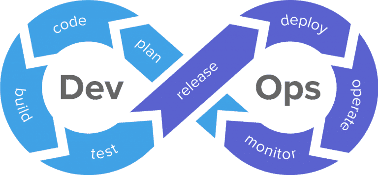

### Hi there, hope you're doing well!. I'm [Brealy Padron Rodriguez](https://brealy-padron-portfolio-react.vercel.app/) 👋, a Full-Stack Developer, based in San Jose, Costa Rica.
### I consider myself as a passionate computer science student, always curious and excited about the new technology trends.
### For the SDLC I have experience building Web Applications based Waterfall/Agile methodologies with OOP (Object Oriented Programming), following DDD (domain-driven design), MVT (Model View Template), MVC (Model Views Controller), Hexagonal & Clean Architectures, also using Class-Based and Functional Programming.
#### I'm specialized with Front-end & Back-End Agile Development. I'm emdebed with DevOps & DevSecOps Culture.

# Top Technologies
## Front-End:

## Back-End: 

## Databases: 

.

.

## DevOps: 

- 🤔 I’m looking for better oportunities and projects to growth my skills and gain experience.
- ⚡ Fun fact: I play video games, play the guitar/sing and learn new technologies very often.
- 🔭 My Portfolio: https://brealy-padron-portfolio-react.vercel.app/

:mailbox: Reach me out!
  

- neighbordevcr@gmail.com

 
  
# Stats: 

